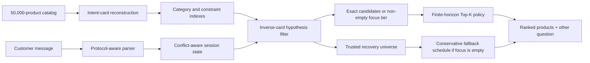

# InverseCart: Offline Conversational Product Search

**TikTok TechJam 2026 · Track 4 — Shopping Copilot**

InverseCart is a deterministic shopping agent that treats every catalog product
as a hypothesis about the conversation the customer would have. It reconstructs
the intent card behind each of 50,000 products, keeps the hypotheses consistent
with the dialogue, and plans **how many products to expose now** against the
expected value of learning from the next clarification.

The complete competition runtime is offline and uses only the Python standard
library: no LLM call, API key, GPU, vector database, model download, or network
connection is required.

| Runtime | Catalog | Model tokens | External APIs | Tests |
|---|---:|---:|---:|---:|
| Python 3.10+ | 50,000 products | 0 | 0 | 60 passing |

## Results at a glance

The final inverse-DP candidate and uniform-prior choice were selected on 2,000
reproducible generated-development sessions whose target products have zero
overlap with the organizer's public 200. The reported final public result was
produced after the integration freeze.

| Evaluation | Sessions | Hit Rate@10 | MRR | MTTC | Technical Score |
|---|---:|---:|---:|---:|---:|
| **Organizer public integration check** | 200 | **1.0000** | **0.997500** | **2.7950** | **0.963350** |
| Generated development | 2,000 | 0.9935 | 0.977300 | 2.6255 | 0.957430 |
| Post-freeze generated regression | 800 | 0.9975 | 0.980420 | 2.5850 | 0.961176 |

On the same organizer public 200, the released weak-BM25 starter scored HR@10
`0.1250`, MRR `0.068034`, MTTC `9.8100`, and Technical Score `0.106710`.

These results are development and public-integration evidence, not a prediction
of organizer-private performance. See [Evaluation](docs/EVALUATION.md) for
scenario results, ablations, dataset construction, and caveats.

`TechnicalScore` is the released objective composite used as an input to
Technical Execution; it is not the complete judged Technical Execution score or
the final hackathon score.

## What makes the approach different

### 1. Model-based product hypothesis inference

From the published interaction protocol, InverseCart derives a compact intent
representation for every product. A product remains a candidate when its card
could have generated the conversation observed so far. This turns multi-turn
search into structured hypothesis inference instead of repeatedly issuing
independent text queries.

### 2. Recommendation depth is optimized against clarification

Returning ten products immediately improves coverage but may end a successful
session at a poor reciprocal rank. Returning too few wastes turns. For a fixed
candidate ordering, a finite-horizon dynamic program evaluates every possible
recommendation cutoff, combines immediate rank reward with the expected value
of the next `other` reply, and chooses the best cutoff for the current belief
state.

### 3. Uncertain language is reversible

Exact, catalog-grounded protocol evidence may safely narrow eligibility. A
paraphrased or weakly grounded interpretation creates only a high-priority
**focus tier**; it cannot delete the **trusted recovery universe**. If the focus
tier is exhausted, the target can return instead of remaining trapped behind a
plausible but incorrect parser decision.

### 4. Overrides are state transitions, not fresh searches

The state tracker separates the customer's active intent from useful historical
evidence. A conflicting same-slot replacement such as `leather -> canvas`
deactivates the old value, while compatible evidence remains searchable. It also
repairs provisional miss history when an Intent Override session becomes known.

## Architecture



The runtime has five stages:

1. **Catalog indexing** — reconstruct category, up to two hard constraints, and
   the released up-to-two-value soft suffix for each product; build exact
   constraint and category indexes in one catalog pass.
2. **Message parsing** — recognize category, requirement, preference,
   disclosure, negation, no-preference, and override events while preserving
   the original catalog-value span.
3. **State transition** — update active, superseded, negative, and retrieval
   evidence without confusing an override with a new session.
4. **Hypothesis inference** — replay trusted released-protocol evidence against
   candidate intent cards; observed hard values remain mandatory on that path,
   while uncertain evidence narrows only the reversible focus tier.
5. **Dialogue planning** — use dynamic programming on exact candidates or a
   non-empty focus tier; use a conservative `1 / 2 / up to 10` schedule when
   only recovery remains, then ask `other` for more evidence.

The detailed state model, recurrence, trust boundary, and complexity discussion
are in [Technical architecture](docs/ARCHITECTURE.md).

## Quick start

Python 3.10 or newer is supported.

```bash
git clone https://github.com/sonlexuan3000/Techjam.git
cd Techjam
make setup
make test
make demo
```

`make setup` creates `.venv`, downloads the frozen organizer catalog, verifies
its SHA-256 checksum, and validates the 50,000-row count. `make demo` runs a
deterministic end-to-end conversation against that catalog.

Useful reproduction commands:

```bash
# Reproduce the 2,000-session development and 800-session regression datasets
make unseen-data

# Evaluate the selected backend without using the organizer public set
make evaluate-unseen-dev

# Run the frozen 100-case language diagnostic
make human-stress

# Build the deterministic source-only competition bundle
make submission-archive
```

The organizer public evaluation is deliberately guarded. After the backend is
frozen, reproduce the recorded integration result with:

```bash
make integration-check
```

## Deterministic demo trace

The default `make demo` target starts inside a non-trivial category and normally
requires clarification:

| Turn | Customer evidence | Agent action | Ranked result |
|---:|---|---|---|
| 1 | “I'm looking for Underwear Undershirts, but I'm still exploring.” | Ask `other`; return one candidate | `B000TGPTOC` |
| 2 | `cotton`; `60% Cotton, 40% Polyester` | Update the product hypotheses; ask `other` | hidden target `B0CKQ3CKZH` at rank 1 |

This trace is deterministic against the frozen catalog. It shows the hypothesis
pool narrowing after one two-value disclosure; it is not a semantic-paraphrase
demo.

## Finite-horizon recommendation policy

For a hit at turn `t` and rank `r`, the per-session contribution to the released
Technical Score is:

```text
reward(t, r) = 0.50 + 0.30 / r + 0.02 × (11 - t)
```

For every `k` from 1 to the requested Top-K cap, the policy evaluates:

- the probability-weighted reward of a target appearing in ranks `1..k`;
- the miss branch, where the recommended prefix becomes rejected evidence;
- every group of remaining hypotheses that would produce the same next `other`
  reply;
- the remaining horizon through turn 10;
- the released Boundary-session probability when it is still applicable.

The selected belief prior is uniform. A catalog `rating_number` prior was tested
as an ablation but slightly reduced MRR and Technical Score. The DP is optimal
only inside the released card construction, disclosure policy, scenario model,
uniform-prior assumption, score function, and ten-turn horizon.

## NLP safety boundary

The language layer is wrapper-tolerant, not a general semantic model.

| Evidence route | How it is used |
|---|---|
| Released wrapper + grounded catalog value | Trusted hypothesis filtering and DP |
| Recognized paraphrased wrapper | Canonicalized value, focus-tier ranking, recovery retained |
| Exact catalog phrase inside unknown prose | Non-destructive `catalog_fallback` evidence |
| Negation | Removes confidently matched forbidden evidence when a safe alternative exists |
| Same-slot override | Supersedes the conflicting old value and reopens the focus tier |
| Unknown semantic rewrite | Preserved without irreversible filtering |

Wrapper changes that preserved the exact catalog value produced `0/2,000`
differing scored-session summaries (hit, first-hit turn, and rank) against the
canonical generated-development sessions.
Value-level semantic rewrites remain a known weakness: for example,
`not wet in rain` is not guaranteed to ground to `waterproof`. The recovery
design limits the damage of that miss; it does not claim to solve semantic
equivalence.

## Ablation

All variants below were evaluated on the same generated-development split.

| Backend | HR@10 | MRR | MTTC | Technical Score |
|---|---:|---:|---:|---:|
| Previous exact-evidence backend | 0.9865 | 0.852769 | 2.7010 | 0.915061 |
| **Uniform inverse-DP — selected** | **0.9935** | **0.977300** | **2.6255** | **0.957430** |
| Catalog `rating_number` prior | 0.9935 | 0.975782 | 2.6860 | 0.955765 |

The selected backend improves Technical Score by `0.042369` and MRR by
`0.124531` over the previous exact-evidence backend without external data beyond
the organizer-supplied catalog.

## Runtime profile

Measured on an Apple M4 with the 50,000-product catalog:

| Measurement | Result |
|---|---:|
| One-time index startup | 5.75 s |
| Maximum resident memory | ~199 MiB |
| Response latency, mean | 30.045 ms |
| Response latency, median | 2.368 ms |
| Response latency, p95 | 136.585 ms |
| Response latency, maximum | 847.916 ms |
| Runtime prompt/completion tokens | 0 / 0 |
| Marginal runtime model cost | $0 |

Latency was measured across 500 turns from 200 generated-development sessions;
timing varies with hardware and candidate-pool size.

## Competition interface

```python
from submission.agent import Agent

agent = Agent("data/catalog.jsonl")
agent.reset(session_id, user_profile)
response = agent.respond(session_id, user_message, turn=1, top_k=10)
```

Each response follows the required contract:

```python
{
    "message": "Which two product details matter most to you?",
    "ask_attribute": "other",
    "recommendations": [{"parent_asin": "B000..."}],
    "usage": {"prompt_tokens": 0, "completion_tokens": 0},
}
```

See [submission/README.md](submission/README.md) for standalone harness usage and
[docs/agent_api_contract.json](docs/agent_api_contract.json) for the complete
machine-readable contract.

## Repository map

```text
submission/                         self-contained offline competition bundle
  agent.py                          required Agent entrypoint
  src/shopping_copilot/core.py      inverse filtering, recovery, ranking, DP
  src/shopping_copilot/parser.py    message-to-event parser
  src/shopping_copilot/             state tracking and wrapper normalization
starter/                            compatibility imports for the local harness
evaluator/                          deterministic released evaluator
scripts/                            setup, generation, benchmarks, demo, packaging
tests/                              state, parser, contract, and integration tests
experiments/                        preserved algorithm ablations
docs/ARCHITECTURE.md                algorithm and state-machine deep dive
docs/EVALUATION.md                  metrics, protocol, ablations, and caveats
docs/DEVPOST_SUBMISSION.md          ready-to-paste project narrative
```

## Limitations

- The score gain depends on the released intent-card construction, disclosure
  order, scenario behavior, metric, and ten-turn horizon. Changed private
  mechanics may reduce it.
- On an intentionally adversarial, model-generated out-of-distribution
  diagnostic, exact-value grounding passed `42/52` cases while semantic-value
  grounding passed `1/35`. See the evaluation report for the complete result.
- `user_profile` is stored per session but is not used for ranking because no
  safe, measured personalization improvement was established.
- One Agent instance supports multiple sequential sessions but requires an
  external lock if embedded in a concurrent server.

## Submission material

- [Standalone backend instructions](submission/README.md)
- [Technical report](submission/REPORT.md)
- [Technical architecture](docs/ARCHITECTURE.md)
- [Evaluation report](docs/EVALUATION.md)
- [Devpost copy](docs/DEVPOST_SUBMISSION.md)
- [Data attribution](DATA_ATTRIBUTION.md)
- [Development provenance](docs/DEVELOPMENT_PROVENANCE.md)

The technical report records implementation contributions verifiable from the
Track 4 repository. The final team roster is maintained in the Devpost entry.

## Data and development disclosure

The runtime uses the organizer-supplied catalog derived from Amazon Reviews
2023. See [Data attribution](DATA_ATTRIBUTION.md). OpenAI Codex assisted with
development-time inspection, review, testing, benchmark orchestration, and
documentation; Codex is not imported or called by the submitted Agent.
