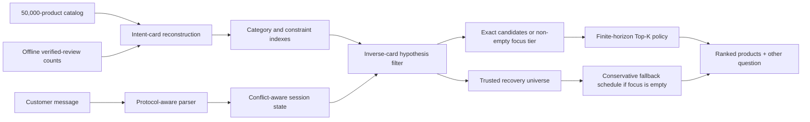

# InverseCart: Offline Conversational Product Search

**TikTok TechJam 2026 · Track 4 — Shopping Copilot**

InverseCart is a deterministic shopping agent that treats every catalog product
as a hypothesis about the conversation the customer would have. It reconstructs
the intent card behind each of 50,000 products, keeps the hypotheses consistent
with the dialogue, and plans **how many products to expose now** against the
expected value of learning from the next clarification.

The complete competition runtime is offline and uses only the Python standard
library. It bundles one compact, product-level popularity prior derived from
Amazon Reviews 2023; no LLM call, API key, GPU, vector database, model download,
or network connection is required.

| Runtime | Catalog | Model tokens | External APIs | Tests |
|---|---:|---:|---:|---:|
| Python 3.10+ | 50,000 products | 0 | 0 | 66 passing |

## Results at a glance

The inverse-DP algorithm was selected on 2,000 reproducible generated sessions
whose target products have zero overlap with the organizer's public 200. After
the team confirmed with the judges that external data was permitted, the final
offline review-count prior was selected on the organizer-labeled public
development set. We report that choice and its contrary generated-holdout
result together rather than treating either distribution as private evidence.

| Evaluation | Sessions | Hit Rate@10 | MRR | MTTC | Technical Score |
|---|---:|---:|---:|---:|---:|
| **Organizer public development — final prior** | 200 | **1.0000** | **1.000000** | **1.8400** | **0.983200** |
| Generated development — final prior | 2,000 | 0.9945 | 0.978687 | 2.6200 | 0.958456 |
| Generated holdout — final prior | 800 | 0.9925 | 0.976574 | 2.5950 | 0.957322 |

On the same organizer public 200, the released weak-BM25 starter scored HR@10
`0.1250`, MRR `0.068034`, MTTC `9.8100`, and Technical Score `0.106710`.

Against the identical uniform-prior backend, the final prior moved the public
target earlier in 117 sessions, left 82 unchanged, and moved one later. It
improved public Technical Score by `0.019850`, but regressed by `0.003854` on
the generated holdout. The generated fixtures sample eligible target products
roughly uniformly, whereas the review prior assumes that product popularity is
informative; the opposing result is therefore an important distribution
diagnostic, not hidden-test evidence.

These results are development evidence, not a prediction of organizer-private
performance. See [Evaluation](docs/EVALUATION.md) for the complete A/B,
scenario results, dataset construction, and caveats.

`TechnicalScore` is the released objective composite used as an input to
Technical Execution; it is not the complete judged Technical Execution score or
the final hackathon score.

## What makes the approach different

### 1. Model-based product hypothesis inference

From the published interaction protocol, InverseCart derives a compact intent
representation for every product. A product remains a candidate when its card
could have generated the conversation observed so far. This turns multi-turn
search into structured hypothesis inference instead of repeatedly issuing
independent text queries.

### 2. Recommendation depth is optimized against clarification

Returning ten products immediately improves coverage but may end a successful
session at a poor reciprocal rank. Returning too few wastes turns. For a fixed
candidate ordering, a finite-horizon dynamic program evaluates every possible
recommendation cutoff, combines immediate rank reward with the expected value
of the next `other` reply, and chooses the best cutoff for the current belief
state.

### 3. Uncertain language is reversible

Exact, catalog-grounded protocol evidence may safely narrow eligibility. A
paraphrased or weakly grounded interpretation creates only a high-priority
**focus tier**; it cannot delete the **trusted recovery universe**. If the focus
tier is exhausted, the target can return instead of remaining trapped behind a
plausible but incorrect parser decision.

### 4. Overrides are state transitions, not fresh searches

The state tracker separates the customer's active intent from useful historical
evidence. A conflicting same-slot replacement such as `leather -> canvas`
deactivates the old value, while compatible evidence remains searchable. It also
repairs provisional miss history when an Intent Override session becomes known.

### 5. Offline popularity shapes belief, never eligibility

A 365-day verified-review aggregate assigns probability mass among products
that already satisfy the conversation. It cannot bypass a hard constraint or
delete a zero-review product. This separation lets the prior accelerate public
MTTC from `2.7950` to `1.8400` while keeping the retrieval safety invariant
auditable.

## Architecture



The runtime has five stages:

1. **Catalog indexing** — reconstruct category, up to two hard constraints, and
   the released up-to-two-value soft suffix for each product; join the bundled
   one-number-per-product review prior; build exact constraint and category
   indexes in one catalog pass.
2. **Message parsing** — recognize category, requirement, preference,
   disclosure, negation, no-preference, and override events while preserving
   the original catalog-value span.
3. **State transition** — update active, superseded, negative, and retrieval
   evidence without confusing an override with a new session.
4. **Hypothesis inference** — replay trusted released-protocol evidence against
   candidate intent cards; observed hard values remain mandatory on that path,
   while uncertain evidence narrows only the reversible focus tier.
5. **Dialogue planning** — use dynamic programming on exact candidates or a
   non-empty focus tier; use a conservative `1 / 2 / up to 10` schedule when
   only recovery remains, then ask `other` for more evidence.

The detailed state model, recurrence, trust boundary, and complexity discussion
are in [Technical architecture](docs/ARCHITECTURE.md).

## Quick start

Python 3.10 or newer is supported.

```bash
git clone https://github.com/sonlexuan3000/Techjam.git
cd Techjam
make setup
make test
make demo
```

`make setup` creates `.venv`, downloads the frozen organizer catalog, verifies
its SHA-256 checksum and 50,000-row count, then verifies the bundled prior's
checksum and exact catalog-ASIN coverage. `make demo` runs a deterministic
end-to-end conversation against that catalog.

Useful reproduction commands:

```bash
# Reproduce the 2,000-session development and 800-session holdout datasets
make unseen-data

# Evaluate the selected backend without using the organizer public set
make evaluate-unseen-dev

# Run the frozen 100-case language diagnostic
make human-stress

# Build the deterministic offline competition bundle
make submission-archive
```

Reproduce the disclosed organizer public development result with:

```bash
make integration-check
```

To choose a public or generated-development session and watch the
agent/customer exchange as an animated chat, run:

```bash
make frontend
```

Then open `http://localhost:8787`. The viewer uses the same customer simulator
and stopping rules as the local evaluator; see [frontend/README.md](frontend/README.md).

## Deterministic demo trace

The default `make demo` target starts inside a non-trivial category and normally
requires clarification:

| Turn | Customer evidence | Agent action | Ranked result |
|---:|---|---|---|
| 1 | “I'm looking for Sandals Flats, but I'm still exploring.” | Ask `other`; return one candidate | `B093P3MCWT` |
| 2 | `gift set for women`; `color: black` | Update the product hypotheses; ask `other` | hidden target `B0BZZL9XJQ` at rank 1 |

This trace is deterministic against the frozen catalog. It shows the hypothesis
pool narrowing after one two-value disclosure; it is not a semantic-paraphrase
demo.

## Finite-horizon recommendation policy

For a hit at turn `t` and rank `r`, the per-session contribution to the released
Technical Score is:

```text
reward(t, r) = 0.50 + 0.30 / r + 0.02 × (11 - t)
```

For every `k` from 1 to the requested Top-K cap, the policy evaluates:

- the probability-weighted reward of a target appearing in ranks `1..k`;
- the miss branch, where the recommended prefix becomes rejected evidence;
- every group of remaining hypotheses that would produce the same next `other`
  reply;
- the remaining horizon through turn 10;
- the released Boundary-session probability when it is still applicable.

The selected belief weight is `verified_reviews_365d + 1`. The aggregate counts
verified review records in a 365-day window ending before `2023-10-01`; `+1`
keeps products with zero observed reviews possible. It changes both the fixed
candidate order and the probability mass used by the DP. The policy is optimal
only inside the released card construction, disclosure policy, scenario model,
this prior assumption, score function, and ten-turn horizon.

## NLP safety boundary

The language layer is wrapper-tolerant, not a general semantic model.

| Evidence route | How it is used |
|---|---|
| Released wrapper + grounded catalog value | Trusted hypothesis filtering and DP |
| Recognized paraphrased wrapper | Canonicalized value, focus-tier ranking, recovery retained |
| Exact catalog phrase inside unknown prose | Non-destructive `catalog_fallback` evidence |
| Negation | Removes confidently matched forbidden evidence when a safe alternative exists |
| Same-slot override | Supersedes the conflicting old value and reopens the focus tier |
| Unknown semantic rewrite | Preserved without irreversible filtering |

Wrapper changes that preserved the exact catalog value produced the same final
prior score (`0.958456`) and `0/2,000` differing scored-session summaries (hit,
first-hit turn, and rank) against the canonical generated-development sessions.
Value-level semantic rewrites remain a known weakness: for example,
`not wet in rain` is not guaranteed to ground to `waterproof`. The recovery
design limits the damage of that miss; it does not claim to solve semantic
equivalence.

## Ablation

The first four variants below were evaluated on the same generated-development
split. The public A/B uses the identical final core and differs only in prior.

| Backend | HR@10 | MRR | MTTC | Technical Score |
|---|---:|---:|---:|---:|
| Previous exact-evidence backend | 0.9865 | 0.852769 | 2.7010 | 0.915061 |
| Uniform inverse-DP | 0.9935 | 0.977300 | 2.6255 | 0.957430 |
| Catalog `rating_number` prior | 0.9935 | 0.974768 | 2.6890 | 0.955400 |
| **Offline verified-review prior — shipped** | **0.9945** | **0.978687** | **2.6200** | **0.958456** |

The shipped backend improves generated-development Technical Score by
`0.043395` and MRR by `0.125918` over the previous exact-evidence backend. Its
gain over uniform on this split is smaller (`+0.001026`) than its public gain.

## Runtime profile

Measured on an Apple M4 with the 50,000-product catalog:

| Measurement | Result |
|---|---:|
| One-time index startup | 6.4312 s |
| Agent startup RSS increment | 194.80 MiB |
| Response latency, mean | 17.527 ms |
| Response latency, p95 | 74.693 ms |
| Runtime prompt/completion tokens | 0 / 0 |
| Marginal runtime model cost | $0 |

Latency was measured across 368 response calls from the organizer public
development sessions. The full diagnostic process peaked near `403.39 MiB`
because it also held a second evaluator catalog index. Timing varies with
hardware and candidate-pool size.

## Competition interface

```python
from submission.agent import Agent

agent = Agent("data/catalog.jsonl")
agent.reset(session_id, user_profile)
response = agent.respond(session_id, user_message, turn=1, top_k=10)
```

Each response follows the required contract:

```python
{
    "message": "Which two product details matter most to you?",
    "ask_attribute": "other",
    "recommendations": [{"parent_asin": "B000..."}],
    "usage": {"prompt_tokens": 0, "completion_tokens": 0},
}
```

See [submission/README.md](submission/README.md) for standalone harness usage and
[docs/agent_api_contract.json](docs/agent_api_contract.json) for the complete
machine-readable contract.

## Repository map

```text
submission/                         self-contained offline competition bundle
  agent.py                          required Agent entrypoint
  data/review_prior.tsv             aggregate offline product prior
  src/shopping_copilot/core.py      inverse filtering, recovery, ranking, DP
  src/shopping_copilot/parser.py    message-to-event parser
  src/shopping_copilot/             state tracking and wrapper normalization
starter/                            compatibility imports for the local harness
evaluator/                          deterministic released evaluator
scripts/                            setup, generation, benchmarks, demo, packaging
tests/                              state, parser, contract, and integration tests
experiments/                        preserved algorithm ablations
docs/ARCHITECTURE.md                algorithm and state-machine deep dive
docs/EVALUATION.md                  metrics, protocol, ablations, and caveats
docs/DEVPOST_SUBMISSION.md          ready-to-paste project narrative
```

## Limitations

- The score gain depends on the released intent-card construction, disclosure
  order, scenario behavior, metric, review-prior assumption, and ten-turn
  horizon. Changed private mechanics or target distribution may reduce it.
- The public 200 was used to select the final prior after external data was
  confirmed permitted. It is labeled development data, not an unbiased estimate
  of the private score.
- The prior aggregates the full disclosed source before its fixed cutoff and
  may include periods later treated as held out. It contains no private/session
  labels, but is not claimed to be temporally leakage-free.
- On an intentionally adversarial, model-generated out-of-distribution
  diagnostic, exact-value grounding passed `42/52` cases while semantic-value
  grounding passed `1/35`. See the evaluation report for the complete result.
- `user_profile` is stored per session but is not used for ranking because no
  safe, measured personalization improvement was established.
- One Agent instance supports multiple sequential sessions but requires an
  external lock if embedded in a concurrent server.

## Submission material

- [Standalone backend instructions](submission/README.md)
- [Technical report](submission/REPORT.md)
- [Technical architecture](docs/ARCHITECTURE.md)
- [Evaluation report](docs/EVALUATION.md)
- [Devpost copy](docs/DEVPOST_SUBMISSION.md)
- [Data attribution](DATA_ATTRIBUTION.md)
- [Development provenance](docs/DEVELOPMENT_PROVENANCE.md)

The technical report records implementation contributions verifiable from the
Track 4 repository. The final team roster is maintained in the Devpost entry.

## Data and development disclosure

The runtime uses the organizer-supplied catalog plus a disclosed aggregate
verified-review-count prior derived from Amazon Reviews 2023. The compact TSV
contains no review text, timestamps, user identifiers, or per-session/private
labels. See [Data attribution](DATA_ATTRIBUTION.md) and
[`submission/data/README.md`](submission/data/README.md). OpenAI Codex assisted
with development-time inspection, review, testing, benchmark orchestration, and
documentation; Codex is not imported or called by the submitted Agent.
