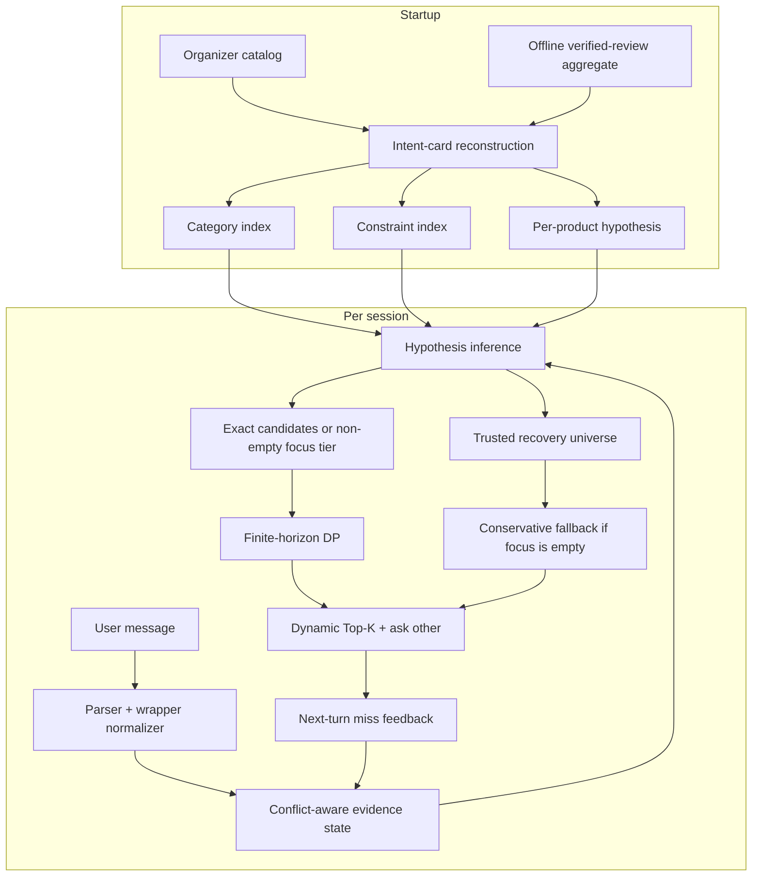

# InverseCart technical architecture

This document describes the final offline backend exported by
`submission.agent.Agent`. It focuses on the design decisions that affect
retrieval quality, dialogue policy, failure recovery, and reproducibility.

## Design objective

The competition score rewards three outcomes at once:

- include the hidden target in the first ten valid recommendations;
- place it as high as possible in that ranked list;
- find it in as few conversation turns as possible.

Those objectives conflict. Returning more products increases immediate
coverage but can lock in a poor reciprocal rank. Allowing another clarification
can improve ordering but consumes the turn-efficiency budget. InverseCart
therefore models **recommendation count as a dialogue action**, rather than
returning a fixed Top-K on every turn. The structured question remains `other`;
the planner optimizes response depth, not question type.

## System overview



## 1. Catalog-to-intent reconstruction

The released evaluator deterministically converts product metadata into a small
intent card. InverseCart applies the same participant-visible construction to
all 50,000 catalog products during startup:

```text
ProductIntent
  parent_asin
  coarse category
  hard constraints: up to the first two generated values
  soft preferences: the next two values, or the evaluator's first-value
                    fallback for a sparse card
  searchable catalog text
  offline popularity weight
  optional catalog statistics for controlled ablations
```

Values are derived from `features`, `details`, material/color mentions, and a
synthetic budget value when price is available. The implementation reproduces
the evaluator's cleaning, ordering, truncation, and de-duplication behavior.
An exhaustive release audit verified zero card/category mismatches across all
50,000 products; the selected candidate suite also retains focused parity
regressions.

The runtime builds these indexes in the same catalog pass:

- normalized initial-message to possible product ASINs;
- coarse category to product ASINs;
- exact reconstructed constraint to product ASINs;
- selected material and color words to product ASINs.

The startup join also loads one aggregate `verified_reviews_365d` count per
`parent_asin`. No individual review, review text, timestamp, user identifier,
public-session label, private-session label, embedding, or external retrieval
service is loaded.

## 2. Conversation as hypothesis inference

For product `p`, let `card(p)` be its ordered hard/soft values. A product is an
exact-path hypothesis when the transcript seen so far is a transcript that the
released customer policy could have produced from `card(p)`.

The exact path replays four pieces of protocol state:

1. the initial scenario message;
2. which card values have already been disclosed;
3. the ordered pair of values that a later `other` response would reveal;
4. the timing and replacement behavior of an Intent Override session.

This is stricter than bag-of-words retrieval. Two products with similar text can
separate if their ordered cards would generate different replies. Conversely,
all products capable of generating the same observed conversation remain valid
hypotheses.

### Hard/soft relaxation

When an exact full-card intersection becomes empty, the agent does not discard
already observed hard evidence. It relaxes only the soft suffix and rebuilds a
candidate set compatible with category and disclosed hard constraints. Products
already proven wrong by a scored recommendation remain excluded.

## 3. Protocol trust and reversible recovery

Private evaluation may preserve the underlying values while changing the prose
around them. Treating every parser output as a hard fact is unsafe: a wrong
interpretation can leave a non-empty candidate pool that permanently excludes
the target, so an empty-pool fallback would arrive too late.

InverseCart separates **focus** from **eligibility**:

```text
trusted universe
  The last eligibility set established by trusted protocol evidence, or the
  full catalog when language is already uncertain on turn one.

focus tier
  Products favored by the current NLP interpretation.
  This tier is ranked first, but uncertain evidence cannot redefine eligibility.

recovery tier
  Remaining trusted products, materialized when the focus tier is exhausted.
```

The trust decision is monotonic for a session. Once a message requires the NLP
fallback path, later canonical-looking text does not silently promote the whole
transcript back to trusted protocol evidence.

### Evidence routes

| Route | Grounding | Effect |
|---|---|---|
| Released protocol | All disclosed values match catalog indexes | Exact inverse filtering |
| Recognized wrapper paraphrase | Parser extracts a supported event/value | Focus-tier filtering with recovery retained |
| Unknown wrapper with an exact catalog phrase | Bounded token n-gram lookup | Ranking evidence only |
| Unresolved text | No confident catalog grounding | Preserved; no destructive intersection |

The fallback phrase lookup enumerates bounded n-grams from the short incoming
message and queries the index. It does not scan every catalog phrase per turn.
Original character spans are retained so punctuation-bearing values survive.

## 4. Conflict-aware intent state

The intent tracker records each clue with:

```text
text, source, slot, canonical values,
active, searchable, superseded, negated
```

Four slots are treated as confidently exclusive when their values conflict:
`material`, `color`, `size`, and `budget`. Generic features are non-exclusive;
for example, `breathable` and `waterproof` may both describe the same product.

An override performs a state transition:

- deactivate the explicit or most relevant old preference;
- mark it superseded;
- remove it from retrieval only when the new value conflicts in the same
  exclusive slot;
- add the new value as active override evidence;
- reopen candidates that were shown before the override became scoreable.

Negation is tracked separately and receives a strong ranking penalty. If
subtracting a negative set would empty the current pool, the tracker searches
for globally allowed alternatives rather than placing forbidden products first.

## 5. Finite-horizon Top-K planning

Each DP hypothesis is a pair:

```text
(parent_asin, disclosed_constraint_mask)
```

The mask records which values in that product's reconstructed card have already
been revealed. Each surviving product carries the smoothed offline belief
weight:

```text
w(p) = verified_reviews_365d(p) + 1
```

The count covers verified Amazon Reviews 2023 records in the 365-day window
ending at the exclusive `2023-10-01` cutoff. Smoothing keeps a product with no
observed review possible.

### Immediate reward

The released aggregate score can be written as a per-session hit reward. A hit
at turn `t` and rank `r` contributes:

```text
R(t, r) = 0.50 + 0.30 / r + 0.02 × (11 - t)
```

A miss contributes zero Hit Rate and MRR, while turn 11 is used in MTTC.

### Recurrence

For each candidate prefix length `k`, the policy sums:

```text
V(t, H) = max over k {
    immediate hit reward for ranks 1..k
    + expected V(t + 1, H_reply) over every possible next reply
}
```

The miss branch removes the recommended prefix. Every remaining product predicts
the next one-or-two-value response that its own card would produce to `other`.
Products with the same predicted response form a branch `H_reply`; branch and
immediate-hit probabilities use the sum of `w(p)` in that branch, and the DP
then recurses with updated disclosure masks.

On the first vague Browsing/Boundary turn, the recurrence also includes the
released `1/9` conditional probability that a shared “still exploring” message
belongs to the Boundary scenario. Results are memoized within the response.

The chosen `k` is therefore dynamic on the exact path and while a non-empty
focus tier exists. It depends on the candidate ordering, remaining turns,
requested Top-K, already disclosed values, possible future partitions, and
whether Boundary behavior can still occur. On the selected review-prior path,
exact candidates are ordered by smoothed review weight, then catalog
`rating_number`, average rating, and stable `parent_asin`. DP optimizes the
prefix length for that fixed order; it does not optimize the permutation.

When uncertain NLP produces no focus candidates, the full DP is deliberately
not applied to an unreliable ordering. The recovery ranker orders by clue
relevance with `rating_number` as a final tie-break, then uses a conservative
schedule: one recommendation on turn one, two on turn two, and up to ten from
turn three onward.

### Why the shipped prior uses offline reviews

The organizer-labeled public development set showed that recent verified-review
volume was informative for target order: against the identical uniform core,
the prior moved the target earlier in `117/200` sessions, left `82/200`
unchanged, and moved one later. Public MTTC improved from `2.7950` to `1.8400`,
and Technical Score from `0.963350` to `0.983200`.

The effect is distribution-dependent. Generated development improved only
`0.001026`, while a generated 800-session holdout regressed `0.003854`. Those
fixtures sample eligible catalog products roughly uniformly, so they do not
encode the popularity assumption that the prior represents. The final prior was
selected on the labeled public development set after the team confirmed that
external data was permitted. No organizer-private session or label was used.

The review count influences exact/focus ordering and expected probability,
never eligibility: it cannot override category or trusted constraints. On that
path, catalog `rating_number` and average rating are deterministic tie-breaks
after review weight. The empty-focus recovery ranker remains clue-first, with
catalog `rating_number` as its late tie-break.

## 6. Miss feedback without an explicit click signal

If the evaluator calls the agent for another turn, every recommendation from
the previous scoreable turn was necessarily a miss. InverseCart adds those
products to a rejected set before planning the new response.

Intent Override is the exception: recommendations made before the replacement
intent arrives are deliberately unscored. The state keeps them separately and
restores them when the first override event is observed. A later override does
not restore products that were genuinely rejected on scoreable turns.

## 7. Why `other` is the clarification action

Under the released simulator, `other` draws up to two values from the complete
remaining card in deterministic order instead of restricting disclosure to one
named attribute. This makes its reply partition over product hypotheses simple
to reconstruct even when named metadata fields are sparse or inconsistent. The
DP models exactly how each possible target would answer that question.

The customer-facing text is a fixed, clear template because the structured
`ask_attribute` field, not prose interpretation, drives the simulator.

## 8. Determinism and deployment properties

- Runtime dependency: Python standard library only.
- Runtime network calls: none.
- Runtime model/API calls: none.
- Randomness in Agent behavior: none.
- Catalog bootstrap: pinned URL, SHA-256 verification, and row-count check.
- Bundled prior: 50,000 product counts; checksum, schema, and exact catalog-ASIN
  coverage are verified during setup; no individual review rows or PII.
- Packaging: deterministic file order and timestamps in the offline-runtime ZIP.
- Session isolation: state is keyed by `session_id`.

One Agent instance supports multiple sequential sessions. Concurrent calls need
an external lock because the in-memory state dictionaries are not synchronized.

## 9. Complexity profile

Let `N` be catalog size, `C` the current exact candidate count, and `M` the
number of hypotheses passed to the DP.

- Prior loading and startup indexing are linear in catalog size and metadata
  volume.
- Exact transcript filtering is `O(C)` per turn.
- Exact fallback phrase lookup is bounded by message length rather than `N`.
- DP cost depends on the number of surviving hypotheses, reply partitions, and
  horizon; memoization removes repeated subproblems within a response.

The measured end-to-end profile is reported in [Evaluation](EVALUATION.md).

## 10. Scope and failure modes

This design is intentionally optimized for the released competition mechanics.
It is not claimed to be a generally optimal commercial shopping policy.

Known failure modes include:

- value-level semantic rewrites with no exact catalog phrase;
- changed private intent-card construction or disclosure order;
- a target distribution that differs materially from the review-popularity
  assumption;
- useful personalization signals not represented in conversation evidence;
- large concurrent workloads without an external serving layer.

The key safety invariant is narrower and testable:

> Uncertain NLP may change ranking focus, but it must not silently redefine the
> trusted recovery universe.
